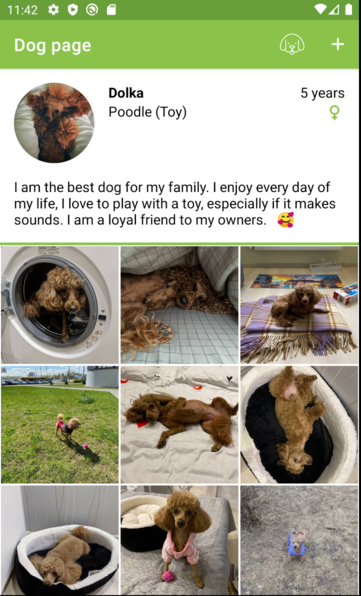

Dog Diary
=========
This project is a dog diary android application made for learning purposes.

This application allows the user to create a profile of their pet - dog. The profile contains basic data (picture, dog name, age, breed, sex and short description).
You can also add posts containing photos and descriptions to it. It is possible to edit the profile and posts at any time (change data, delete posts or the profile itself)

In addition, the user receives notifications with interesting facts about dogs.

Programming language
--------
Kotlin

Architecture
------------
MVVM (Single Activity + Fragments)

Libraries and frameworks
-----------------------------
* Dagger(Hilt)
* Coroutines
* Room 
* Retrofit
* Gson
* AndroidX LiveData
* AndroidX ViewModel
* AndroidX Navigation
* AndroidX WorkManager
* AndroidX ConstraintLayout
* Picasso
* Timber
* Shared Preference
* Firebase Crashlytics

Technical details
-----------------
* Posts are displayed in a grid in recycler view.
* Images are scaled and saved in the application folder.

